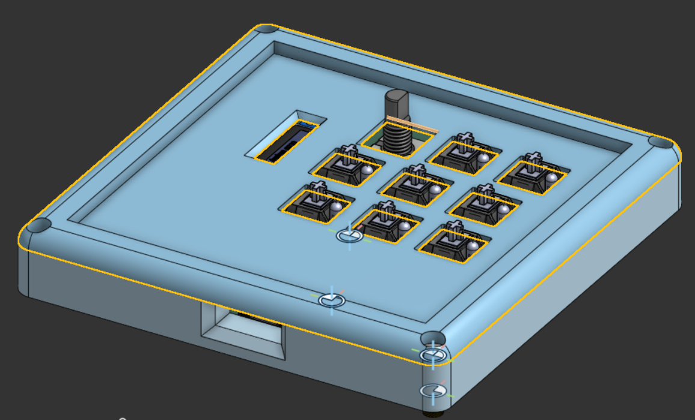
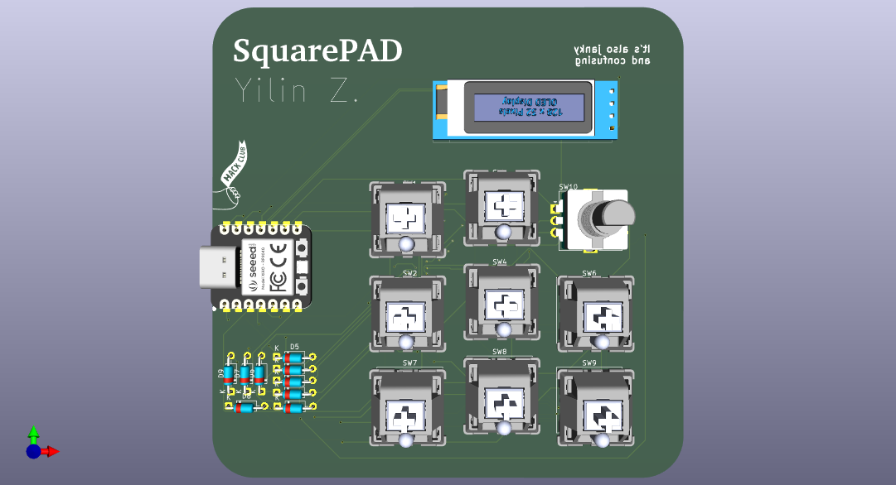
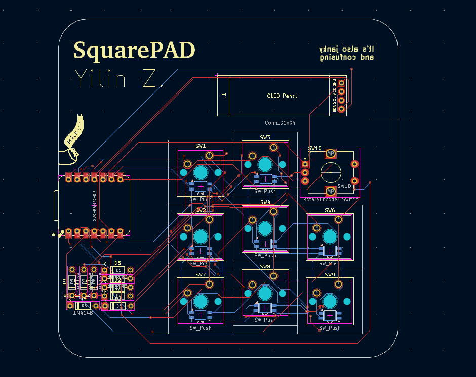
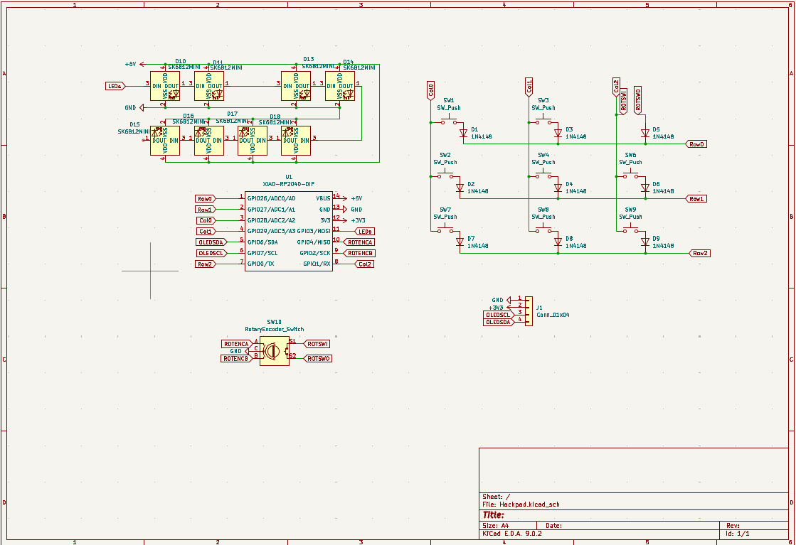

# SquarePad

The **SquarePad** is a custom macropad with 8 switches with backlight LEDs, a rotary encoder, and an OLED screen. The **SquarePad** is a useful tool for custom shortcuts and a knob to manipulate any adjustable parameters for ease of use in different software.
## BOM
- 8x Cherry MX Switches
- 1x Seeed XIAO RP2040
- 1x 0.91in 128x32px OLED
- 1x EC11 Encoder
- 1x 3D printed Top
- 1x 3D printed Bottom
- 4x M3x16mm Screw
- 4x M3x5mx4mm heatset inserts
- 8x SK6812 MINI-E LEDs
- 9x Through-hole 1N4148 Diodes

## Features
- **8 Different Back Light Switches** for me to customize
- **A Rotary Encoder Switch** for me to customize ~~right now set to remove permission from all my files~~ for useful tool or shortcuts
- **Oled Screen** for me to gain maximum stimulation while working
## Story
I planned to make a macro pad for me to use different macros but after some research,I hoped to be able to use the various macros for software such as cadding or automating some processes ~~that literrally just takes a couple seconds~~.
The Case took the most time to complete as I was afraid that the dimensions won't be right and might not be able to fit everything I had on my PCB
The PCB and Schematic took some time as I did some research and ~~copied~~ had some inspiration from others.
The firmware took the least time as I already had prior coding experience.
## PCB

